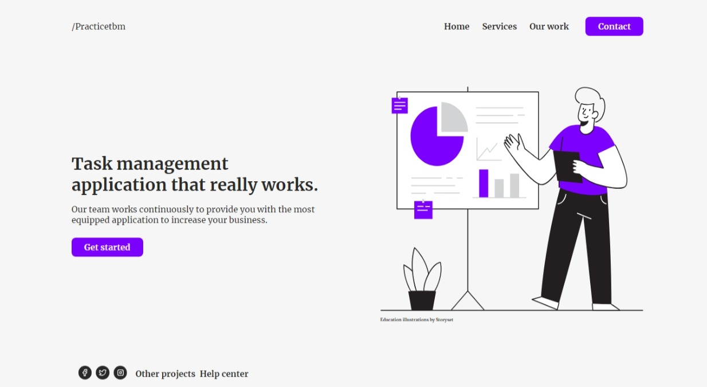
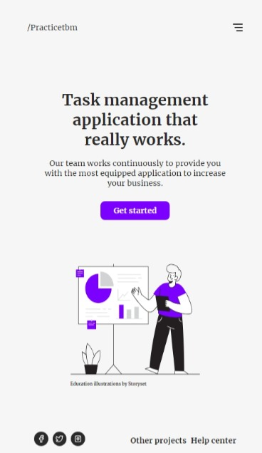

## Práctica de Maquetado con HTML, CSS y SASS

**Descripción:** Maquetado de sección header, utilizando las herramientas HTML, CSS y SASS. 

**Nota:** El diseño, íconos e imágenes fueron tomados de la web con fines de práctica y aprendizaje.

**Visualización en tamaño Desktop:**

**Visualización en tamaño Movil:** 

